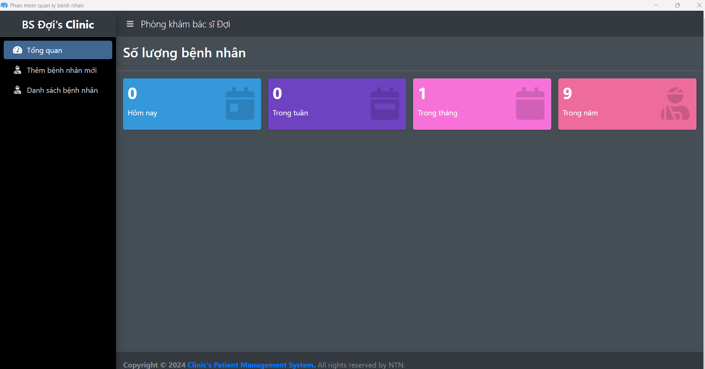

Clinic Management System

Overview
The Clinic Management System is an offline tool designed for small clinics to manage patient registration, and medical records. 
It allows clinics to operate efficiently without an internet connection and provides printable reports.

Features
Offline Operation: No internet required, data is stored locally.
Patient Management: Register, update, and manage patient details and medical history.
Medical Records: Store and access patient treatments, prescriptions, and history.
Printable Documents: Generate and print patient details, prescriptions, and reports.
User-Friendly: Designed for non-technical staff to use easily.

Installation
Clone the repository:
git clone https://github.com/your-username/clinic-management-system.git

Run the application:
PatientManagement.vbs

Backup & Support
Regularly back up your local database to prevent data loss. 
For issues or questions, contact trinamntn08@gmail.com.
